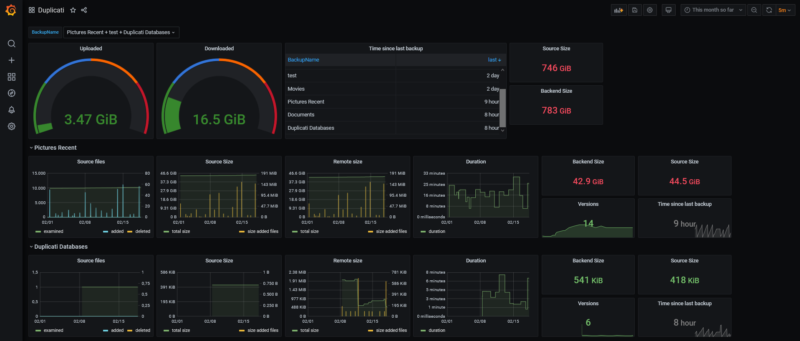

Duplicati monitoring 
====================

### About

Processes the results from Duplicati and puts it in InfluxDB using NodeRED

### Requirements
Nodered, influxdb and grafana need to be installed. As I was playing with Home Assistant, I have added all as addons in Home Assistant OS (running as a virtual machine in VirtualBox), which made it all pretty straightforward to install. 

### Installation
* Import the project in nodered. 
* Update the nodered project to use the correct influxdb settings. 
* Configure duplicati to use this as http-reporting. Make sure you configure duplicati to use json as report format. 
* Import the [grafana dashboard](grafana.json), and make sure it points to the correct influxdb database. Also update the variables to the names of your backup sets.
